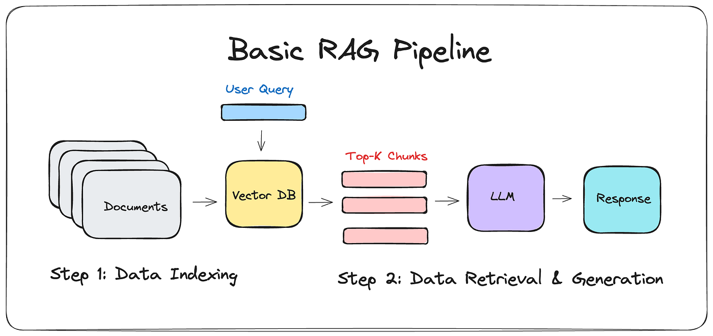

# omop-rag

**omop-rag** is a Python CLI tool designed for accurate mapping of unstructured clinical event names to standardised OMOP concepts.

It leverages a **R**etrieval-**A**ugmented **G**eneration (RAG) approach:

1. **Vector Search:** Uses a pre-trained clinical Sentence Transformer model (`MedEmbed-large-v0.1`) to find the top 10 most similar OMOP concepts (Retrieval) from the already vectorised `concept_embeddings.pt` file, which is a PyTorch vector database generated from all the LOINC lab test concepts in the `lab_concepts.csv` file.
2.  **QA Matching:** Employs a Question-Answering (QA) model (`deepset/roberta-base-squad2`) to select the single best match from those 10 candidates (Generation/Refinement).

## How does RAG work?



In our case, the input documents are OMOP labratory test concepts. These are embedded into a vector database, which the user can query, to pull out closley related concepts to free text lab test events. Another LLM Agent can use this shortened context to provide a more accurate result and match.

-----

## Installation

This project uses **Poetry** for dependency management.

1.  **Install Poetry** (if you haven't already):

    ```bash
    (Invoke-WebRequest -Uri https://install.python-poetry.org -UseBasicParsing).Content | py -
    ```

2.  **Clone the repository:**

    ```bash
    git clone https://github.com/answerdigital/omop-rag.git
    cd omop-rag
    ```

3.  **Install Dependencies:** Poetry will create a virtual environment and install all necessary packages.

    ```bash
    poetry install
    ```

-----

## Command Line Interface (CLI) Usage

The application is run via `poetry run python main.py` followed by one of three **subcommands**: `create-embeddings`, `similar-search`, or `best-match`.

### 1\. `create-embeddings` (Setup)

Skip this step if you want to use our provided LOINC lab test embeddings, the `create-embeddings` process may take a while without GPU power. This command preprocesses your raw concept data into a vector database. It requires two arguments.

| Argument | Description | Example Path |
| :--- | :--- | :--- |
| `--concepts-file` | Path to the input CSV containing OMOP concepts (`concept_name`, `concept_id` columns). | `data/drug_concepts.csv` |
| `--embeddings-file` | Path to save the resulting PyTorch embeddings (`.pt` file). | `embeddings/drug/drug_embeddings.pt` |

**Example:**

```bash
poetry run python main.py create-embeddings \
  --concepts-file data/drug_concepts.csv \
  --embeddings-file embeddings/drug/drug_embeddings.pt
```

-----

### 2\. `similar-search` (Retrieval)

This command queries the vector database to find the top 10 similar concepts for each event in your input CSV. It requires four arguments.

| Argument | Description | Example Path |
| :--- | :--- | :--- |
| `--concepts-file` | Path to the original concepts CSV (used for mapping IDs to names). | `data/lab/lab_concepts.csv` |
| `--embeddings-file` | Path to the pre-created embeddings (`.pt` file) to search against. | `embeddings/lab/concept_embeddings.pt` |
| `--input-csv` | Path to the CSV containing the raw events to query (must have an `EVENT` column). | `data/lab/lab_events.csv` |
| `--output-json` | Path to save the search results JSON file. | `results/lab_similar_results.json` |

**Example:**

```bash
poetry run python main.py similar-search \
  --concepts-file data/lab/lab_concepts.csv \
  --embeddings-file embeddings/lab/concept_embeddings.pt \
  --input-csv data/lab/lab_events.csv \
  --output-json results/lab_similar_results.json
```

**Example Output (`results/lab_similar_results.json` snippet):**

```json
[
  {
    "input": "Haemoglobin levels in blood",
    "similar_concepts": [
      {
        "id": 3005872,
        "name": "Hemoglobin [Presence] in Blood",
        "score": 0.866
      },
      // ... 9 more results
    ]
  },
  {
    "input": "creatinine levels in blood",
    "similar_concepts": [
      {
        "id": 3051825,
        "name": "Creatinine [Mass/volume] in Blood",
        "score": 0.8939
      }
      // ... 9 more results
    ]
  }
]
```

-----

### 3\. `best-match` (Refinement)

This command takes the JSON output from `similar-search`, uses a QA model to select the single best match, and exports the final mapping to a clean CSV. It requires two arguments.

| Argument | Description | Example Path |
| :--- | :--- | :--- |
| `--input-json` | Path to the input JSON file from the `similar-search` step. | `results/lab_similar_results.json` |
| `--output-csv` | Path to save the final concept mapping CSV file. | `results/lab_matches.csv` |

**Example:**

```bash
poetry run python main.py best-match \
  --input-json results/lab_similar_results.json \
  --output-csv results/lab_matches.csv
```

**Example Output (`results/lab_matches.csv`):**

| raw\_event\_input | concept\_id | concept\_name |
| :--- | :--- | :--- |
| Haemoglobin levels in blood | 3005872 | Hemoglobin [Presence] in Blood |
| creatinine levels in blood | 3051825 | Creatinine [Mass/volume] in Blood |
| o2 sat test | 3016502 | Oxygen saturation in Arterial blood |
| ph blood | 3010421 | pH of Blood |
| potassium levels in blood | 21490733 | Potassium [Mass/volume] in Blood |
| na levels in blood | 3000285 | Sodium [Moles/volume] in Blood |

-----

## Full Workflow

To run the complete concept mapping pipeline from raw concepts to final matches, execute the three commands in sequence:

```bash
# 1. Create the vector database
poetry run python main.py create-embeddings --concepts-file data/lab/lab_concepts.csv --embeddings-file embeddings/lab/concept_embeddings.pt

# 2. Find the top 10 similar concepts for each event
poetry run python main.py similar-search --concepts-file data/lab/lab_concepts.csv --embeddings-file embeddings/lab/concept_embeddings.pt --input-csv data/lab/lab_events.csv --output-json results/lab_similar_results.json

# 3. Use the QA model to select the single best match
poetry run python main.py best-match --input-json results/lab_similar_results.json --output-csv results/lab_matches.csv
```
